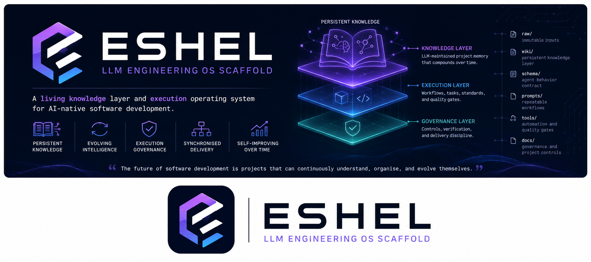

# Echel - LLM Engineering OS Scaffold



Echel is a general-purpose scaffold for AI-native software development.
It implements an LLM Wiki-style persistent knowledge layer plus execution governance for building new systems or evolving existing codebases.

## Echel Story

A month ago, I began building Nitra with Codex. What started as a trading infrastructure project quickly exposed a bigger problem: software projects decay faster than teams can document them. Decisions disappear into chats, architecture drifts away from implementation, and development turns into fragmented tribal knowledge.

So instead of treating documentation as something written after development, I designed a system where documentation evolves alongside the code itself.

Every architectural decision, implementation detail, coding standard, workflow rule, and development insight becomes part of a living knowledge system that continuously updates as the project grows. The project does not just generate code - it generates understanding.

Recently, I came across Andrej Karpathy's concept of the "LLM Wiki," and it was striking to see how closely it aligned with the direction I had already been pursuing independently. The core idea - replacing static documentation and fragmented RAG workflows with an evolving project-native intelligence layer - was exactly the problem I had been trying to solve inside Nitra.

But Echel goes further.

The goal is not simply to build another AI-assisted coding workflow. The goal is to create a development operating system where:

- project knowledge compounds over time
- architecture stays synchronised with implementation
- workflows become self-improving
- standards evolve with the codebase
- and future development becomes faster, more consistent, and less dependent on human memory

In Echel, documentation is no longer passive text. It becomes an active part of the engineering process - analysing ideas, generating tasks, enforcing standards, guiding implementation, and preserving long-term project intelligence.

This project is the result of a simple belief:

> The future of software development is not just AI generating code.
> The future is software projects that can continuously understand, organise, and evolve themselves.

## Echel vs LLM Wiki (Karpathy)

### Where they align

- Both treat project knowledge as a persistent, compounding artifact rather than chat residue.
- Both reject static documentation and one-shot RAG as the primary operating model.
- Both rely on LLMs to continuously maintain and evolve structured project memory.
- Both emphasize that insights should be filed back into durable artifacts, not rediscovered repeatedly.

### Where they differ

- Karpathy's framing is knowledge-first (knowledge compiler behavior is the center of gravity).
- Echel includes that direction, but also adds explicit delivery governance, workflow controls, and execution gates.
- Karpathy focuses primarily on accumulating and organizing knowledge.
- Echel extends into SDLC operation: task structure, standards, verification, memory ledgers, and process enforcement.
- Karpathy's model highlights evolving understanding.
- Echel targets evolving understanding plus evolving implementation discipline.

### Echel's unique advantages

- Combines project knowledge compounding with enforceable engineering process compounding.
- Keeps architecture, implementation, and execution state synchronized through linked artifacts and gates.
- Encodes repeatable delivery behaviors (task methodology, lint/gate checks, governance controls) directly into the system.
- Reduces dependence on tribal memory not only for technical context, but also for how teams execute and improve over time.
- Creates a foundation for a self-improving engineering operating system, not just an AI-maintained wiki.

### Honest gap to close

- Echel's core ambition includes knowledge-compiler behavior, but long-term value depends on how rigorously it captures contradictions, updates canonical models globally, and reuses derived insights across future work.
- The more Echel behaves like a continuously updating internal model of project reality (not only better docs), the closer it gets to the strongest interpretation of the LLM Wiki vision.

## Quick start

```bash
python3 tools/project_init.py --name my-project --mode scratch
make wiki-health
```

For an existing repo:

```bash
python3 tools/project_init.py --name existing-project --mode existing --source /path/to/repo
python3 tools/ingest.py raw/sources/initial-source.md --title "Initial source import" --kind source
make wiki-health
```

Open `wiki/` as an Obsidian vault.

## How to Start with Echel

Echel works best when you use it with three things together:

- an LLM coding tool (`Codex`, `Claude Code`, `Cursor`, or similar)
- `Obsidian` (as the project knowledge interface)
- a curious mind (you drive questions, exploration, and decisions)

### 1) Run the Echel wizard

```bash
make init-wizard
```

The wizard collects the minimum essential information to initialize:

- project mission and boundaries
- architecture references and decision policy
- execution standards and task structure
- governance, memory, and quality-gate controls

### 2) Validate the initialization

```bash
make wiki-health
```

This verifies that generated artifacts, links, and governance controls are consistent and ready.

### 3) Open the wiki in Obsidian

Open `wiki/` as an Obsidian vault.

Echel generates linked Markdown (`[[wikilinks]]`) so project relationships are visible in Obsidian's graph and remain navigable as the system grows.

### 4) Start development with your LLM coding tool

Use your coding assistant (Codex, Claude Code, Cursor, etc.) to:

1. read project context from the wiki
2. pick or create a task artifact
3. implement with verification
4. update linked knowledge artifacts
5. append the session log

### 5) Work in a compounding loop

The development loop is:

`idea -> structured knowledge -> task -> implementation -> verification -> bug management -> RCA -> updated knowledge`

Detailed operating method: [Operational Loop Methodology](docs/development/01-methodology/OPERATIONAL_LOOP_METHODOLOGY.md)

Echel is designed so code and understanding evolve together, not separately.

## Model

```text
raw/      immutable inputs
wiki/     persistent LLM-maintained knowledge layer
schema/   agent behavior contract
prompts/  repeatable workflows
tools/    automation and quality gates
docs/     governance and project controls
```
